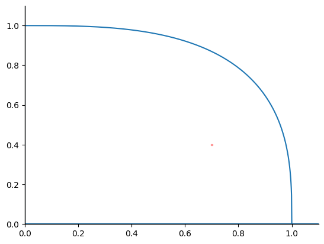
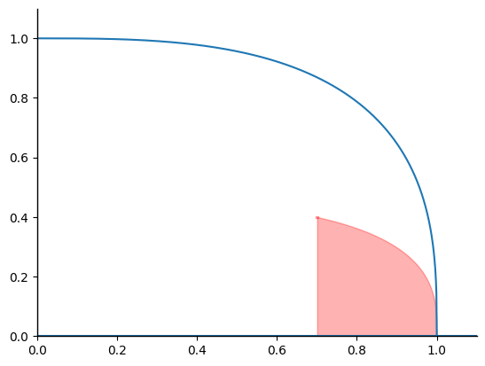
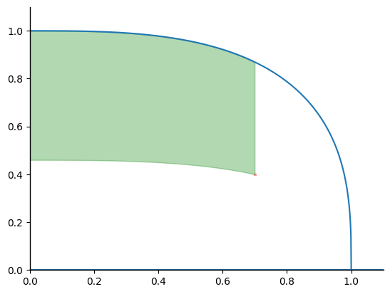
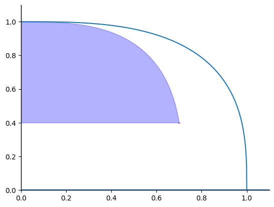
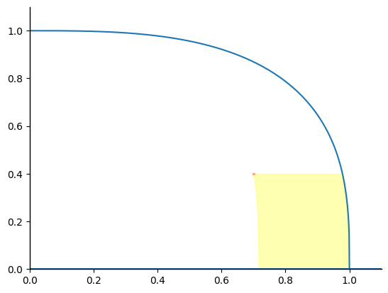
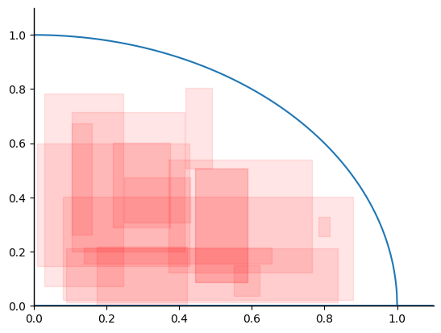

# MohuPy

[简体中文](README_cn.md) | English

MohuPy is a fuzzy mathematics computing toolkit, including the operations of q-rung orthopair fuzzy number(*q-rofn*), interval-valued q-rung orthopair fuzzy number(*iv-q-rofn*) and q-rung orthopair hesitant fuzzy numbers(*q-rohfn*) under algebraic norms. It also provides high-order operations and automatic differentiation for fuzzy vectors and the computational graph model of fuzzy number. It can be used to deal with irregular fuzzy computation, fuzzy decision-making related problems, general higher-order fuzzy computation problems, and differential derivative calculation problems of complex fuzzy functions.

## Features

- Addition, subtraction, multiplication and division of *q-rofn*, *iv-q-rofn*, *q-rohfn* sets with matrices and vectors;
- Operations on high-dimensional fuzzy numbers, matrix operations and vector operations;
- Fuzzy tensor operation and automatic differentiation of *q-rofn*, fuzzy computational graph model of *q-rofn*;
- Representation of non-additive measure, Möbius transformation, calculation of non-additive measure;
- Derivatives of non-additive measure set functions, Shannon entropy, Sugeno integral, Choquet integral and Shilkret integral;
- Eight commonly used membership functions;
- The basic usage of higher order fuzzy set and fuzzy vector, including arbitrary random shape, save, load, maximum minimum sum, etc.

## Installation


```shell
pip install mohupy
```

## Requirements

1. python >= 3.10
2. numpy >= 1.24
3. scipy >= 1.10.0
4. matplotlib >= 3.8.0
5. pandas >= 1.5.0
6. networkx >= 3.1.0

## Get started

### 1. Create fuzzy number

Importing packages is simple, just

```python
import mohupy as mp
```

Then, create a *3-rofn* <0.7,0.4> as follows:

`````python
x = mp.fuzznum(3, 0.7, 0.4)
print(x)
`````

Then it will be displayed as follows:

`````python
<0.7,0.4>
`````

If you need to check the score, membership and non-membership degree of <0.7,0.4>, you can do it as follows:

`````python
print(x.score)
print(x.md, x.nmd)
`````

`````python
0.2789999999999999
0.7 0.4
`````

Note: The initial fuzzy number type is *q-rofn*, and the type of fuzzy number can be adjusted by `mp.config.set_mtype()` ,the global variable function. The type of fuzzy number is represented by `.mtype` , and `.mtype='qrofn'` represents *q-rofn*, `.mtype='ivfn'` represents *iv-q-rofn* and `.mtype='qrohfn'` represents *q-rohfn*. 

`````python
mp.config.set_mtype('ivfn')
print(mp.config.Config.mtype)
`````

`````python
'ivfn'
`````

### 3. Fuzzy set(vector)

Fuzzy vectors can be created using `mp.fuzzset()` to create an empty fuzzy set(vector).

`````python
y = mp.fuzzset()
print(y)
`````

`````python
Fuzzarray([], qrung=None, mtype=qrofn)
`````

It is worth noting that this is an empty initialized fuzzy set(vector). Therefore, `qrung = None`, which represents a fuzzy number, is a null value that can be assigned in subsequent operations. For example, you can create a random *iv-1-rofn* fuzzy matrix:

```````python
mp.config.set_mtype('ivfn')
fuzzy_matrix = mp.rand_fuzz(5,2)
fuzzy_matrix
```````

```python
Fuzzarray([[<[0.1211 0.3985],[0.0445 0.5733]> <[0.1978 0.6394],[0.1696 0.3151]>]
           [<[0.3597 0.5338],[0.3082 0.3306]> <[0.3761 0.5476],[0.0515 0.372 ]>]
           [<[0.437  0.5267],[0.3074 0.3981]> <[0.2731 0.4707],[0.2992 0.4142]>]
           [<[0.0881 0.3158],[0.1707 0.5903]> <[0.1358 0.6692],[0.1511 0.2643]>]
           [<[0.0571 0.1164],[0.363  0.4567]> <[0.0259 0.0657],[0.2901 0.6906]>]], qrung=1, mtype=ivfn)
```

Of course, it is very simple to do the calculation directly on `fuzzy_matrix`. For example, the square can be calculated as follows

```python
fuzzy_matrix ** 2
```

```python
Fuzzarray([[<[0.0147 0.1588],[0.087  0.8179]> <[0.0391 0.4088],[0.3105 0.5309]>]
           [<[0.1294 0.285 ],[0.5214 0.5519]> <[0.1414 0.2998],[0.1003 0.6056]>]
           [<[0.191  0.2774],[0.5203 0.6377]> <[0.0746 0.2216],[0.5088 0.6568]>]
           [<[0.0078 0.0997],[0.3123 0.8321]> <[0.0184 0.4479],[0.2794 0.4588]>]
           [<[0.0033 0.0136],[0.5942 0.7049]> <[0.0007 0.0043],[0.4961 0.9043]>]], qrung=1, mtype=ivfn)
```

### 4. Fuzzy Tensor and Automatic Differentiation

Note that the current fuzzy tensor only supports *q-rofn*, and the description of *iv-q-rofn* and *q-rohfn* in the existing literature is lacking. A fuzzy tensor can be created by function `tensor = mp.Fuzztensor()`. Now, randomly generate a 2D fuzzy tensor and find the derivative with respect to x for a specific function f(x) = 0.2 * x.

`````python
x = mp.rand_tensor(5,2)
fx = 0.2 * x
fx.backward()
print(x)
print(fx)
print(x.grad)
`````

```python
Fuzztensor([[<0.0293,0.3409> <0.1657,0.4683>]
            [<0.142,0.3044> <0.6446,0.2342>]
            [<0.7509,0.0453> <0.0425,0.0003>]
            [<0.8818,0.1123> <0.2809,0.6213>]
            [<0.3699,0.4671> <0.1744,0.081>]], qrung=1, mtype=qrofn)

Fuzztensor([[<0.0059,0.8063> <0.0356,0.8592>]
            [<0.0302,0.7883> <0.1869,0.748>]
            [<0.2427,0.5385> <0.0086,0.1925>]
            [<0.3476,0.6458> <0.0638,0.9092>]
            [<0.0882,0.8588> <0.0376,0.6049>]], qrung=1, mtype=qrofn)

Fuzztensor([[<0.2,0.8> <0.2,0.8>]
            [<0.2,0.8> <0.2,0.8>]
            [<0.2,0.8> <0.2,0.8>]
            [<0.2,0.8> <0.2,0.8>]
            [<0.2,0.8> <0.2,0.8>]], qrung=1, mtype=qrofn)
```

### 5. Fuzzy measure

MohuPy also includes a non-additive measure calculation package. The main fuzzy measures include Dirac measure, Additive measure, Symmetric measure, lambda fuzzy measure and so on. In addition, it also includes Shapley index, Banzhaf index and fuzzy measure Shannon entropy. In terms of non-additive measure integrals, it includes Choquet Integral, Sugeno Integral and Shilkret Integral. Taking the array [0.4, 0.25, 0.37, 0.2] as an example, the dictionary representation of this array under lambda fuzzy measure is as follows

```py
measure = [0.4,0.25,0.37,0.2]
mp.dict_rep(measure, mp.lambda_meas, measure)
```

```python
{'{}': -0.0,
 'C1': 0.4,
 'C2': 0.25,
 'C1,C2': 0.60597,
 'C3': 0.37,
 'C1,C3': 0.704836,
 'C2,C3': 0.579272,
 'C1,C2,C3': 0.877251,
 'C4': 0.2,
 'C1,C4': 0.564776,
 'C2,C4': 0.427985,
 'C1,C2,C4': 0.752608,
 'C3,C4': 0.537418,
 'C1,C3,C4': 0.842768,
 'C2,C3,C4': 0.728261,
 'C1,C2,C3,C4': 1.0}
```

In particular, the Hasse diagram can also be used to view the measure value of the array under the lambda fuzzy measure.

```python
mp.hasse_diagram(measure, mp.lambda_meas)
```


If the Choquet integral of this array is required, it can be computed by the following code

```python
mp.integral.choquet(measure, mp.lambda_meas)
```

```python
0.34044280478185107
```

### 6. Fuzzy Plot

The dot graph of the fuzzy number makes it easy to see the position of the fuzzy number in the fuzzy area. In addition, you can also see the addition area, subtraction area, multiplication area and division area of the fuzzy number. MohuPy has built-in drawing methods, and they are very easy to write. For example, to draw a *3-rofn* <0.7,0.4> and draw each of its operation areas, you can write it like this:

```python
x = mp.fuzznum(3, 0.7,0.4)
mp.fuzz_plot(x)
```



Look at each domain of the fuzzy number separately and write code,

```python
mp.fuzz_plot(x, add=True)
mp.fuzz_plot(x, sub=True)
mp.fuzz_plot(x, mul=True)
mp.fuzz_plot(x, div=True)
```

|  |  |
| :--------------------------------------------------------: | ---------------------------------------------------------- |
|  |  |

Even more, you can draw the distribution of all fuzzy numbers of a fuzzy set. Take 15 random *iv-2-qrofns* as an example, 

```python
mp.config.set_mtype('ivfn')
x = mp.rand_fuzz(15,qrung=2)
mp.fuzz_plot(x, alpha=0.1)
```



## TODO

 - [x] Adopt fuzzy regedit framework
 - [x] q-rung orthopair hesitant fuzzy sets
 - [x] Add more Archimedean norm operations and register (Einstein, Frank, Hamacher)
 - [x] Gradient and automatic differentiation of fuzzy functions
 - [x] Integrate the operations of fuzzy numbers and fuzzy sets into computational graph models
 - [ ] Fuzzy membership generator with membership degree function and non-membership degree function

## Update Log

Update log: [Log](update.md)

## Contact

email: yibocat@yeah.net

## License
[MIT](LICENSE)